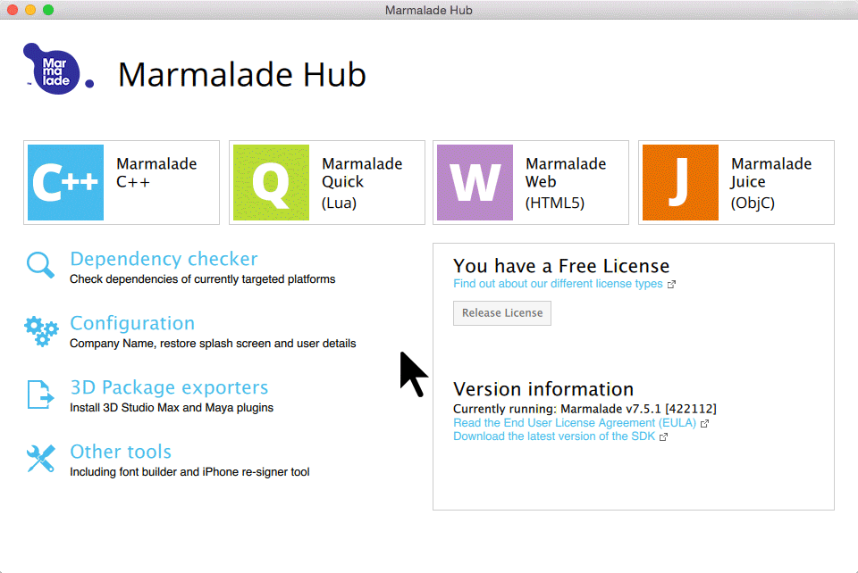

## Gamesparks Cpp Marmalade

The official GameSparks C++ SDK for Marmalade

## Prerequisites

### OS X

1. [download](https://www.madewithmarmalade.com/) and install Marmalade
2. [XCode](https://developer.apple.com/xcode/downloads/)

### Windows

1. [download](https://www.madewithmarmalade.com/) and install Marmalade
2. [download](https://www.python.org/downloads/) and install python 2.7
3. [Visual Studio](http://www.visualstudio.com/downloads/download-visual-studio-vs.aspx)

## running the sample



## Integrating the SDK into your project

- copy the GameSparks directory to a path of your choosing
- modify the 'subprojects' section of your mkb file to reference the GameSparks SDK:


### Example:

```
...
subprojects
{
    iwutil
    ../GameSparks/GameSparks
}
...
```

## License

This library is licensed under the Apache 2.0 License. 
